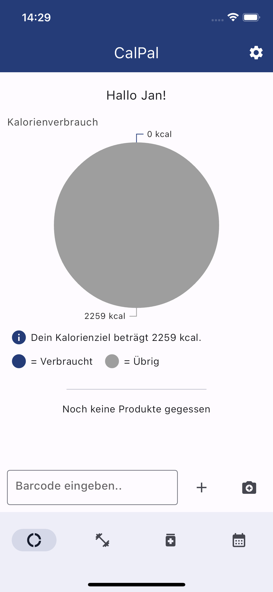
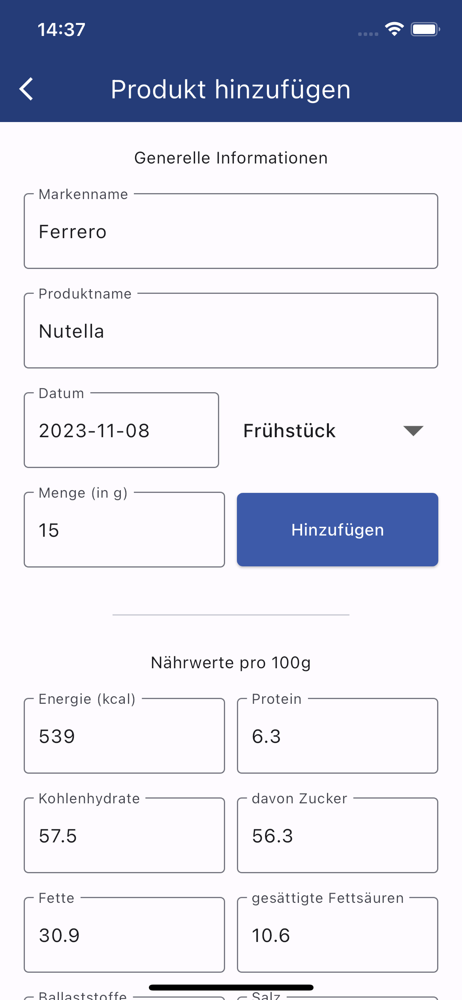
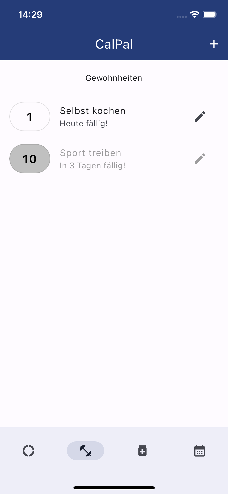

# CalPal
Willkommen in der Welt von CalPal - deiner ultimativen Kalorientracking-App für iOS und Android! Wir präsentieren eine intelligente und benutzerfreundliche Anwendung, die dir hilft, deine Gesundheits- und Fitnessziele zu erreichen, indem sie dir dabei hilft, deine tägliche Kalorienaufnahme zu verfolgen und zu optimieren.

 

## Intuitives Tracking
CalPal bietet eine nahtlose Benutzererfahrung. Scanne einfach Barcodes von Lebensmitteln, wähle aus einer umfangreichen Datenbank oder füge Mahlzeiten manuell hinzu. Verfolge Kalorien, Makronährstoffe und mehr, um ein genaues Bild deiner Ernährung zu erhalten.

## Smartes Ziel
Deine individuellen Ziele stehen im Mittelpunkt. Gib deine Zielsetzungen ein - sei es Abnehmen, Muskelaufbau oder einfach eine gesündere Ernährung. CalPal erstellt daraufhin ein personalisiertes Kalorienziel und schlägt geeignete Mahlzeiten und Snacks vor.

## Fortschrittliche Analysen
Erhalte tiefere Einblicke in deine Ernährungsgewohnheiten. Verfolge nicht nur Kalorien, sondern auch Nährstoffe wie Protein, Kohlenhydrate und Fett. Unsere App liefert dir visuelle Berichte und Diagramme, um deinen Fortschritt zu überwachen.

## Lebe gesünder!
CalPal ist mehr als nur eine App - es ist dein treuer Begleiter auf dem Weg zu einem gesünderen Lebensstil. Egal, ob du abnehmen, Muskeln aufbauen oder einfach bewusster essen möchtest, CalPal bietet die Werkzeuge und Unterstützung, die du benötigst. Starte heute deine Reise zu einem fitteren und vitaleren Ich mit CalPal!

## Tracke deine Gewohnheiten!
CalPal lässt dich deine Gewohnheiten tracken. Wähle aus in welchen Rhythmus du deine Gewohnheiten erledigen willst und schließe fällige Gewohnheiten ab! Deine Streak wird sich freuen!

### Todo:
- Trainingsdatenerfassung und Übersicht (Implementierung in Kalorienzähler)
- Wochenübersichts-Tab.
- Supplements Tab

### Ideen:
- Schrittzähler im Gewohnheiten Tab?
- Werbung oder Premiummodell?

Stand 08.11.2023 umfasst das Projekt circa 2300 Zeilen Code.